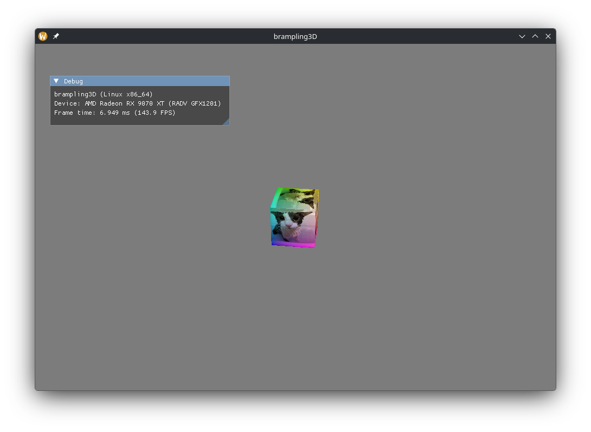

# brampling3D
A custom, cross-platform, homemade game/graphics engine built on Vulkan and SDL3. It supports Windows, Linux, and macOS (via MoltenVK)

**TODO:**
- Make `Engine` less monolithic
- Depth buffer
- Multiple scene objects
- Entity component system
- Shadow mapping, deferred rendering, and other visual effects

## Resources
- [Swim Engine](https://github.com/Swedeachu/Swim-Engine)
- [Vulkan Tutorial](https://vulkan-tutorial.com)
