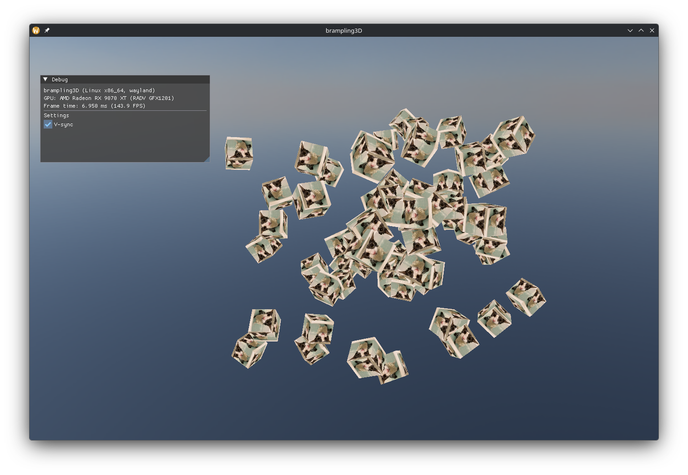

# brampling3D
A custom, cross-platform, homemade game/graphics engine built on Vulkan and SDL3. It supports Windows, Linux, and macOS (via MoltenVK)

**Features:**
- Shaders written in [Slang](https://shader-slang.org/)
- More soon...

## TODO
### Low level
- [ ] Make `Engine` less monolithic
- [x] Depth buffer
- [x] Multiple scene objects
- [x] Camera controls
- [ ] Entity component system
- [ ] Shader hot reloading (recompiles and reloads `.slang` files when written)
- [ ] Smart memory allocator (preferrably from scratch without VMA)
- [ ] Advanced texture format support
- [ ] Model loading

### Features
- [ ] Shadow mapping, deferred rendering, and other visual effects
- [ ] Skeletal animation
- [ ] Audio engine
- [ ] Physics (Jolt)

## Resources
- [Swim Engine](https://github.com/Swedeachu/Swim-Engine)
- [Vulkan Tutorial](https://vulkan-tutorial.com)
